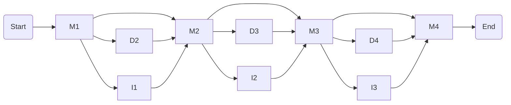

## Profile Hidden Markov Models

### Overview

Profile Hidden Markov Models (HMMs) are statistical models designed to capture the variability and patterns found in multiple sequence alignments (MSAs). They offer a robust way to model conserved regions, sequence motifs, and evolutionary variations, making them an essential tool in bioinformatics for sequence analysis and comparison.

### Structure of a Profile HMM

A Profile HMM is structured to mirror the columns of an MSA, with three main states for each column:

1. **Match States (M):** Represent conserved positions in the alignment, corresponding to columns with similar residues or nucleotides across multiple sequences. Match states store probabilities for each possible amino acid or nucleotide at that position, reflecting the distribution observed in the MSA.

2. **Insertion States (I):** Account for potential insertions between columns, capturing variability by allowing additional residues or nucleotides to be added. These states store probabilities for each possible amino acid or nucleotide to be inserted.

3. **Deletion States (D):** Represent positions where sequences may lack a corresponding residue or nucleotide, resulting in a gap in the alignment. Deletion states enable the model to handle varying lengths in sequences.

### Transition Probabilities

In addition to these states, Profile HMMs include transition probabilities between states, reflecting the likelihood of moving from one state to another. For example, a transition might occur from a match state to an insertion state, or from a match state directly to another match state. These transition probabilities reflect the patterns observed in the MSA and help the model capture sequence variability.

### Applications

Profile HMMs offer several key applications in bioinformatics:

1. **Sequence Alignment:** By comparing a new sequence to a profile HMM, we can identify which regions of the sequence correspond to conserved regions in the MSA, helping to align the new sequence with known homologs.

2. **Domain Detection:** Profile HMMs can identify and characterize functional domains in proteins by matching sequence segments to domain profiles.

3. **Sequence Classification:** By comparing a sequence to various profile HMMs, we can classify it into families or groups, aiding in the identification of evolutionary relationships.

### Conclusion

Profile HMMs provide a sophisticated way to model and analyze sequence alignments, capturing both conserved regions and sequence variability. They extend the capabilities of MSAs, allowing for deeper insights into sequence structures, functions, and relationships.

### Profile HMM Diagram

